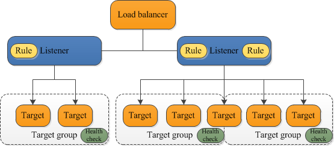

# ALB vs. NLB

|                  | ALB                                     | NLB                             |
|------------------|-----------------------------------------|---------------------------------|
| **OSI Layer**    | 7                                       | 4                               |
| **Target types** | IP, instance, and Lambda                | IP, instance, and ALB           |
| **Protocols**    | HTTP, HTTPS, and gRPC                   | TCP, UDP, and TLS               |
| **Algorithm**    | Round-robin                             | Flow hash                       |
| **Use cases**    | Microservices, containers, and web apps | Games, media streaming, and IoT |

## ALB components

### Listener rules

Each rule consists of a priority, one or more actions, and one or more conditions. (ALB only?)

## References

- https://docs.aws.amazon.com/elasticloadbalancing/latest/application/introduction.html
- https://docs.aws.amazon.com/elasticloadbalancing/latest/network/introduction.html
- https://aws.amazon.com/compare/the-difference-between-the-difference-between-application-network-and-gateway-load-balancing/
- https://aws.amazon.com/what-is/osi-model/