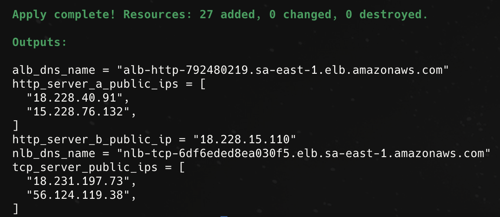
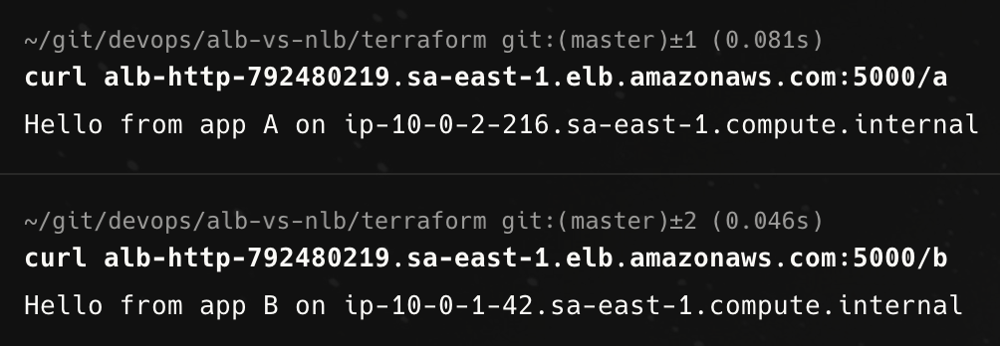
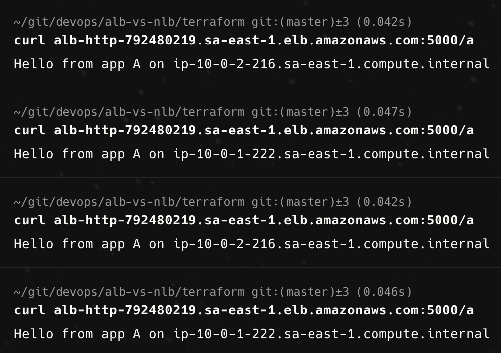
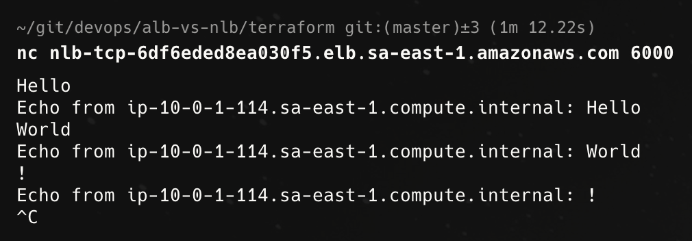
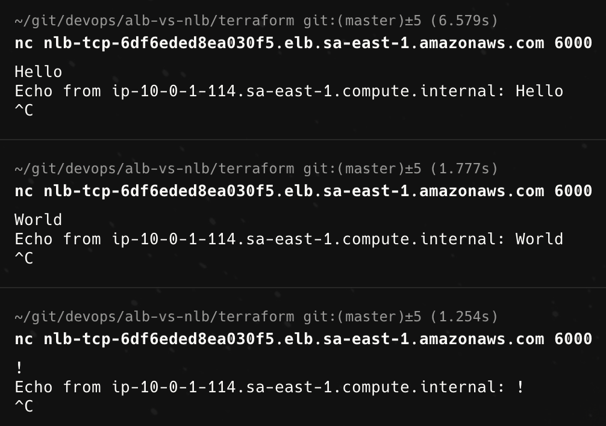
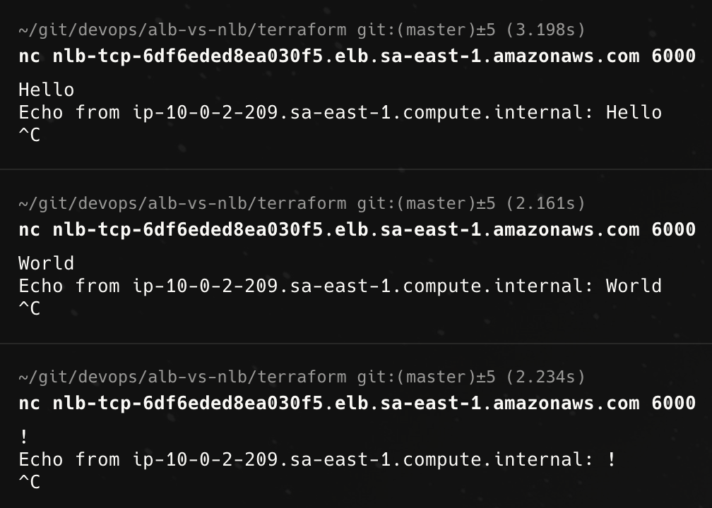
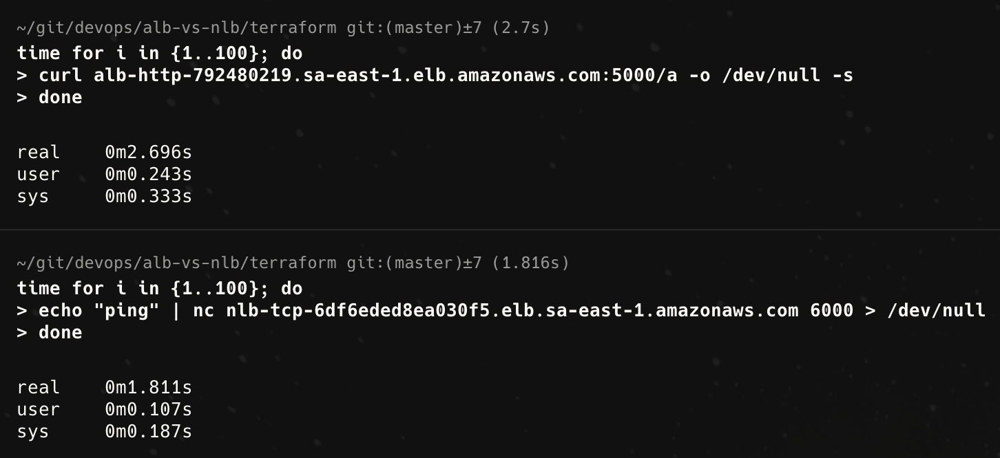
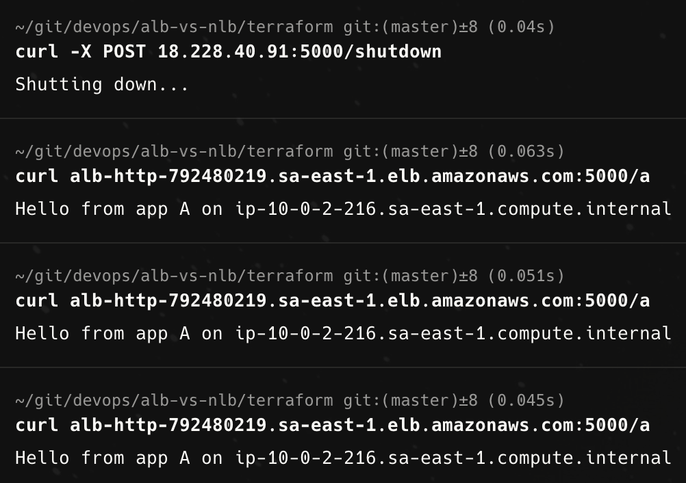
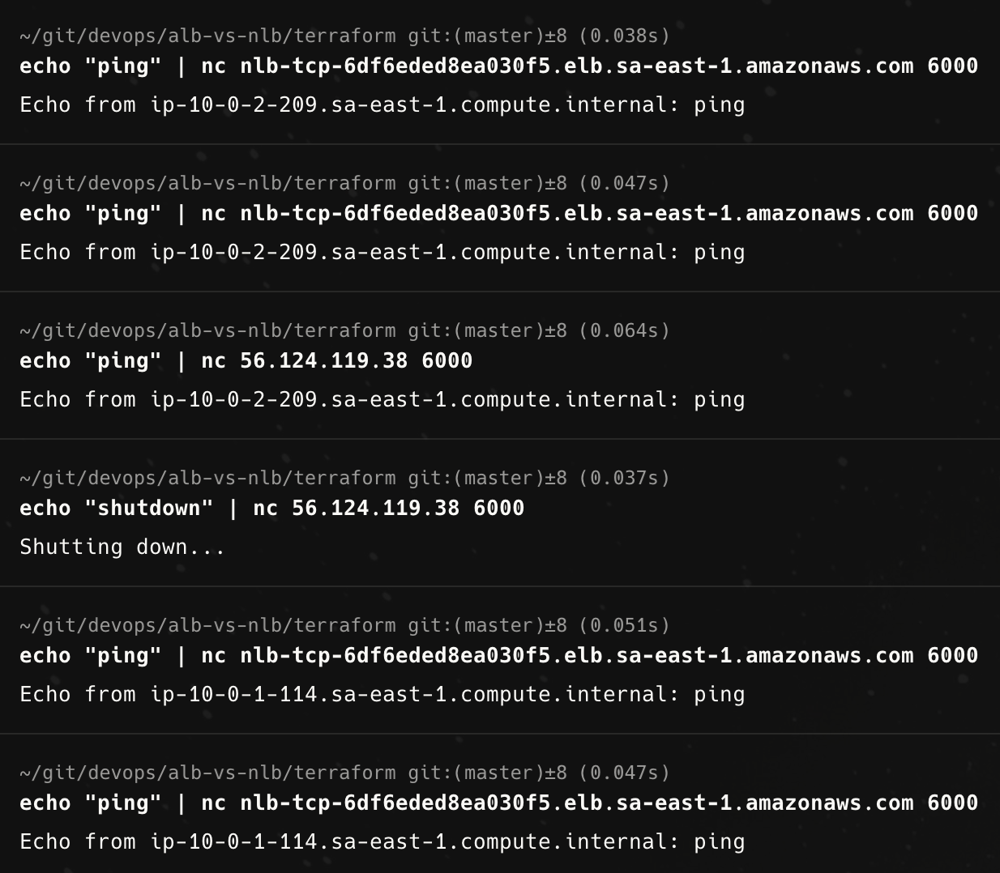

# ALB vs. NLB

## ELB components

## Comparison table

|                  | ALB                                     | NLB                             |
|------------------|-----------------------------------------|---------------------------------|
| **OSI layer**    | 7                                       | 4                               |
| **Target types** | IP, instance, and Lambda                | IP, instance, and ALB           |
| **Protocols**    | HTTP, HTTPS, and gRPC                   | TCP, UDP, and TLS               |
| **Algorithm**    | Round-robin                             | Flow hash                       |
| **Use cases**    | Microservices, containers, and web apps | Games, media streaming, and IoT |

## POCs

### Code

- [Apps](apps)
- [Terraform](terraform)

### Output of `tofu apply`

### ALB: Path-based routing

### ALB: Round-robin algorithm

### NLB: TCP handling

### NLB: Flow hash algorithm

**From my local machine**

**Connected to a VPN**

### Latency comparison

### Health checks

**ALB**

**NLB**

## References

- https://aws.amazon.com/compare/the-difference-between-the-difference-between-application-network-and-gateway-load-balancing/
- https://docs.aws.amazon.com/elasticloadbalancing/latest/userguide/how-elastic-load-balancing-works.html