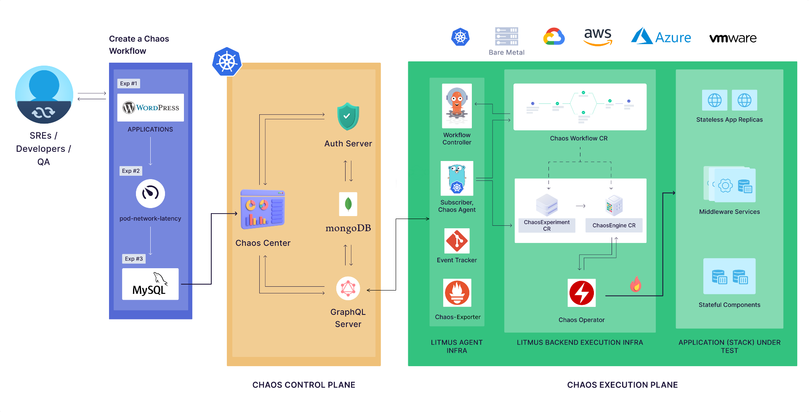
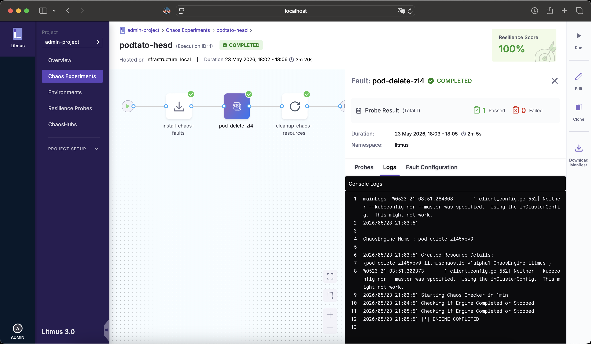

# Litmus

## What is Litmus?

- An open-source Chaos Engineering platform for Kubernetes.
- Pre-built chaos experiments.
- A web UI (ChaosCenter).
- Breaks your system on purpose.

## Architecture



## Experiments

### Pod Chaos

1. Container Kill
1. Disk Fill
1. Pod CPU Hog
1. Pod Memory Hog
1. Pod Delete
1. Pod Network Latency
1. ...

### Node Chaos

1. Node CPU Hog
1. Node Memory Hog
1. Node Restart
1. ...

### Application Chaos

1. Spring Boot App Kill
1. Spring Boot Exception
1. ...

### AWS Chaos

1. EC2 Stop By ID
1. EC2 Stop By Tag
1. ...

### GCP, Azure, VMWare

1. ...

## POC

### 1. Litmus setup

```shell
kind create cluster
helm repo add litmuschaos https://litmuschaos.github.io/litmus-helm/
kubectl create ns litmus
helm install chaos litmuschaos/litmus --namespace=litmus --set portal.frontend.service.type=NodePort --set portal.server.graphqlServer.CHAOS_CENTER_UI_ENDPOINT=http://chaos-litmus-frontend-service.litmus.svc.cluster.local:9091 --set mongodb.image.registry=docker.io --set mongodb.image.repository=bitnami/mongodb --set mongodb.image.tag=latest --set mongodb.auth.enabled=true --set mongodb.auth.rootPassword=password
kubectl port-forward svc/chaos-litmus-frontend-service -n litmus 9091:9091
```

### 2. Podtato-head setup

```shell
kubectl apply -f https://github.com/podtato-head/podtato-head-app/releases/download/v0.3.3/manifest.yaml
kubectl label deployment podtato-head-hat app=podtato-head-hat -n podtato-kubectl
```

### 3. Chaos Infrastructure setup

```shell
kubectl apply -f local-litmus-chaos-enable.yml
```

### 4. Resilience Probe setup

- Type: `cmdProbe`
- Name: `check-podtato-head-hat-pod`
- Timeout: `10s`
- Interval: `1s`
- Attempt: `1`
- Command: `kubectl get pods -n podtato-kubectl | grep podtato-head-hat | grep Running | wc -l`
- Type: `Int`
- Comparison Criteria: `>`
- Value: `0`

### 5. Chaos Experiment setup

- Chaos Fault: `pod-delete`
- App Kind: `deployment`
- App Namespace: `podtato-kubectl`
- App Label: `app=podtato-head-hat`
- Probe Name: `check-podtato-head-hat-pod`
- Mode: `EOT` (End of Test)

### 6. Result



### 7. Cleanup

```shell
kind delete cluster
```

## Comparison

### Litmus

- 2019
- Open-source
- Kubernetes

### Other tools

- Chaos Monkey (pioneer, open-sourced in 2012)
- Gremlin (commercial tool, 2017)
- AWS FIS (2021)
- Chaos Mesh (open-source, K8s, 2019)
    - No resilience probe
    - No "Pass" or "Fail"